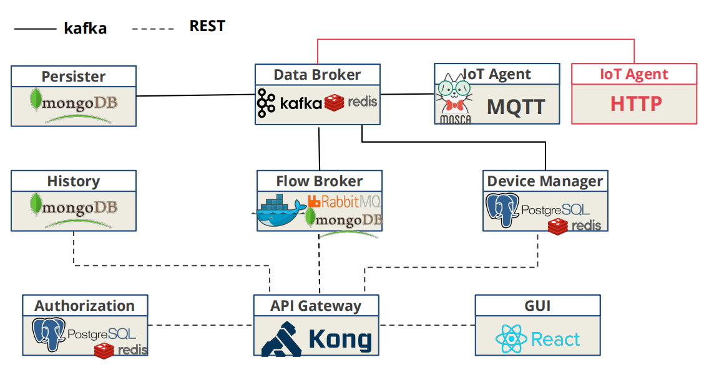

# IoT Agent Microsservice - HTTP

[Dojot](https://github.com/dojot) was designed to make fast solution prototyping possible, providing a platform that’s easy to use, scalable and robust on IoT context. Its internal architecture makes use of many well-known open-source components with others designed and implemented by dojot team.

An IoT Agent is a custom microservice required to integrate a device that is not supported by default on the middleware platform:

<p align="center">

</p>

Once devices are configured, the HTTP IoT Agent is capable of mapping the data received from devices, encapsulated on HTTP and send them to the message broker for internal distribution. This way, the data reaches the persistence service, for instance, so it can persist the data on a database.

## Development

Using Dojot involves dealing with the following entities:

- physical devices: devices that sends messages to IoT agents. They might have sensors and might be configurable, but this is not mandatory. Also, they must have some kind of connectivity to other services so that they can send their readings to these services.

- users: whoever sends requests to dojot in order to manage resources, retrieve historical device data, create subscriptions, manage flows, and so on.

- tenants: logical separation between resources that might be associated with multiple users.

- resources: elements that are associated to a particular entity. They are:

- devices: representation of a element which has attributes. This element can be a physical device or a virtual one - one that doesn’t receive attribute updates directly by a device.
templates: device blueprints that contain a list of attributes associated to that class of devices (...)

Check the Dojot's [documentation](https://dojotdocs.readthedocs.io/en/latest/iotagent-architecture.html) for more. 

When a new IoT agent is created, in our case, an HTTP agent, all these entities must be taken into account in a coordinated way. In the index.js of our microsservice, we need to set properly the tenants the that will be considered for receiving messages:

```Javascript
const context = {
    port: process.env.SERVER_PORT || 8002,
    service: iotAgent,
    tenants: ['app'], //replacement by list yours tenants
    server
};
```

The Class /services/App.js is a stub for your personalized service that will intercept the http messages received by your devices at Dojot. This is possible because the module [@dojot/iotagent-nodejs](https://github.com/dojot/iotagent-nodejs) encapsulates for us all communication with the platform by calling the handleDeviceMessage() method.

## Build Image

First, let's start this microservice:

```bash
$ sudo docker build -t dojot/iotagent-http .
```

Then you need to regenerate the docker-compose.yml of the [Dojot](https://github.com/dojot/docker-compose) to include this new microservice (compose.yaml), and start it:

```bash
# cd ../docker-compose
$ sudo docker-compose up
```

Wait some seconds and check its log:

```bash
# cd ../docker-compose
$ sudo docker-compose logs -f iotagent-http
```
